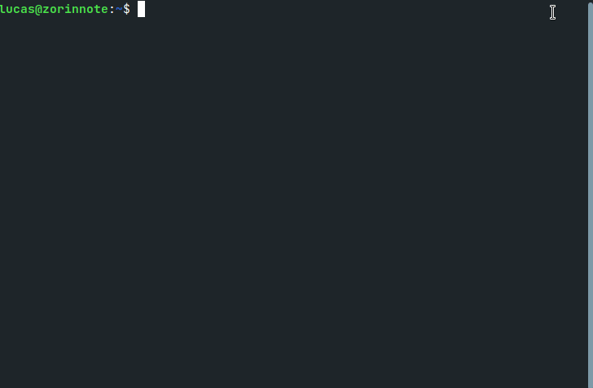
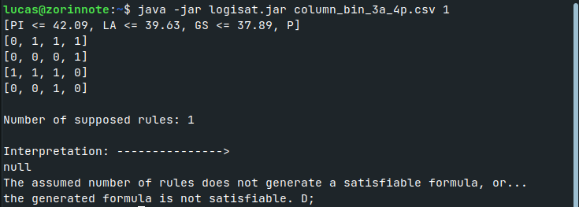

<h1 align="center">
    </img>
    <b>logisat</b>
</h1>

## Sobre 📚

O projeto **logisat** foi desenvolvido durante a disciplina **Lógica para Computação** do curso de Ciências da Computação do Instituto Federal de Educação, Ciência e Tecnologia do Ceará (IFCE), Campus  Maracanaú . Durante o curso, até a realização deste projeto, foram estudados todos os conceitos fundamentais de **modelagem de problemas** utilizando **lógica proposicional**, colocando todos os conceitos em prática durante o desenvolvimento, que consiste em um **algoritmo de aprendizagem de regras** para classificação de patologias da coluna vertebral.

---

## Como Funciona? 📚

Cada arquivo **.csv** possui informações de alguns pacientes. Para cada uma dessas informações, o arquivo contém várias colunas com intervalos de valores sobre essa informação. Cada coluna representada como um atributo e cada linha um paciente, na qual **"P"** representa se o paciente apresenta a patologia ou não.

Cada, atributo possui uma sigla e um limitante inferior ou superior, na qual cada sigla representa:

- Ângulo de incidência pélvica (PI)
- Ãngulo de versão pélvica (PT)
- ângulo de lordose (LA)
- Inclinação sacral (SS)
- Raio pélvico (RP)
- Grau de deslizamento (GS)

Com uma tabela de informações similar a:

| PI <= 42.09 | PI <= 70.62 | GS <= 57.55 | P |
|:-----------:|:-----------:|:-----------:|:-:|
|      0      |      0      |      1      | 1 |
|      0      |      0      |      0      | 1 |
|      0      |      1      |      0      | 0 |

A partir do conjunto de dados acima o algoritmo irá analisar se existe um número **m** de regras que classifique corretamente a patogenicidade de cada paciente.

Utilizando este exemplo, temos que para **m = 1** uma possível regra de classificação gerada pelo algoritmo poderia ser:

$$
\lbrace[\normalsize PI>42.09, PI>70.62]\Rightarrow P \rbrace
$$

Para **m = 2** ainda é possível gerar um conjunto de duas regras:

$$
\lbrace[\normalsize PI>42.09, PI>70.62]\Rightarrow P, \  [\normalsize  S\leq 57.55]\Rightarrow P \rbrace
$$

Se **pelo menos uma regra** do conjunto se aplicar ao paciente, então ele possui a patologia.

---

## Conceitos Importantes Utilizados 💼

- **Fórmulas da Lógica Proposicional**
- **Valorações**
- **Semântica**
- **Representação de Sentenças**
- **Validade**
- **Satisfatibilidade**

---

## Linguagem Utilizada 🚀

- **Java**

---

## Como Utilizar? 🔧

O binário executavel **logisat.jar** (que pode ser baixado [aqui](https://github.com/lucasferreiraz/logisat/releases)) já inclui internamente todos os arquivos **.csv** que foram disponibilizados para teste, sendo necessário apenas passar o nome do arquivo completo no primeiro parâmetro na chamada no programa seguido do segunto parâmetro, sendo este último um número inteiro, que é o número de regras suposto inicialmente. <br><br>
A lista de arquivos **.csv** suportados no programa são os mesmos que foram disponibilizados e o nome deles podem ser encontrado nesta [pasta](/src/data).


```bash
java -jar logisat.jar [fileName] [numberRules]
```

Posto isto, para utilizar, acesse a pasta onde o arquivo binário **.jar** está e abra o terminal na mesma pasta utilizando o seguinte comando, por exemplo, para o arquivo **column_bin_3a_3p.csv**.

```bash
java -jar logisat.jar column_bin_3a_3p.csv 2
```

---

## Demonstração 🖥️



Caso a fórmula gerada seja **insatisfatível** ou o numero suposto para o conjunto de regras não seja suficiente, será retornado o seguinte:



---
<p align="center" style="font-weight:bolder">
    Developed with 💛 by <a href="https://github.com/lucasferreiraz">Lucas Ferreira</a> & <a href="https://github.com/walysonrodrigo">Walyson Rodrigo</a>
    
</p>